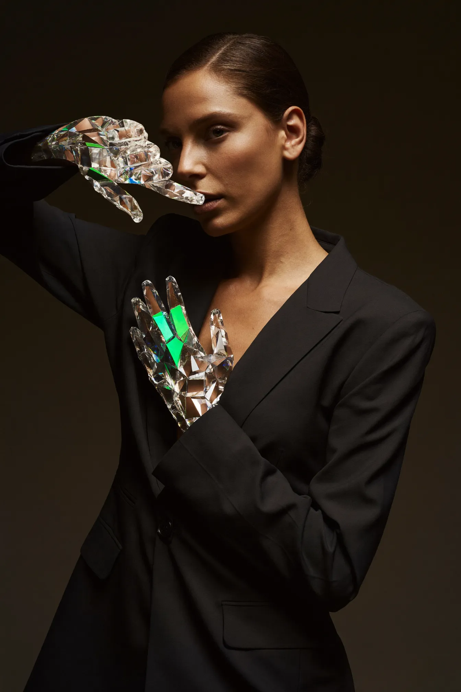
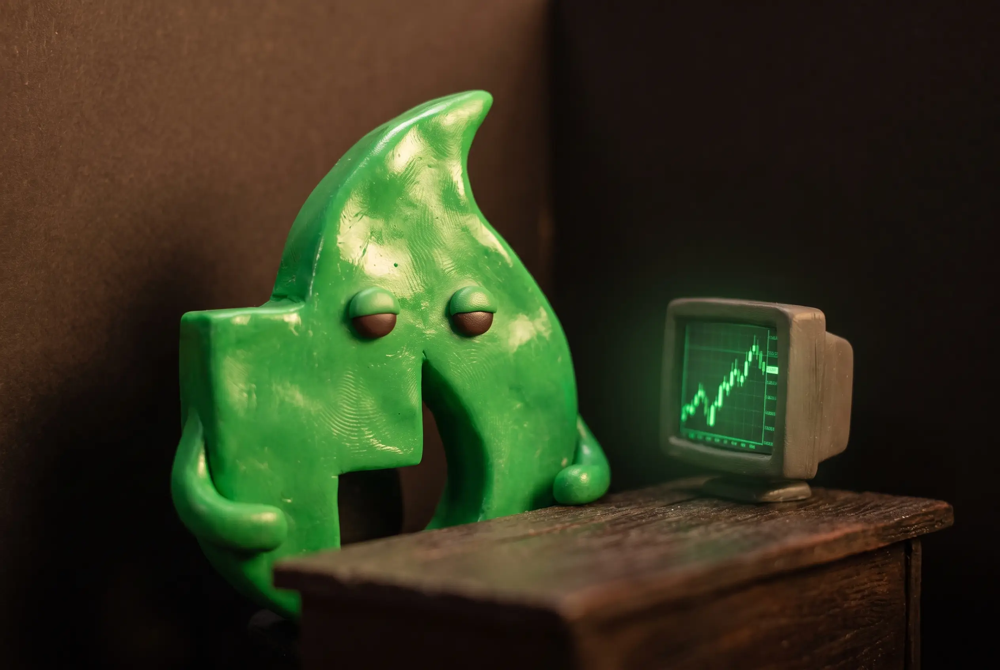

# $FIRE — Character Cast & Commercial Concepts

Concept round v1 — generated 2026-07-22 with Higgsfield (Soul 2.0 for photoreal, Nano Banana Pro for surreal/mascot/multi-panel). All concepts follow the v3 "Terminal Dark" direction: brokerage-statement premium, warm near-black, Robin green `#00C805`, red `#FF5000` reserved for losses, restraint as the signal. No wojak brutalism.

Winner previews live in this folder as `.webp`. Full-res PNGs + all variants are linked per character below (Higgsfield CDN). Job IDs are listed so any image can be re-displayed, upscaled, or used as an Element/character reference for video.

---

## The cast

### 1. The Holder — brand hero

The flagship. A calm, impeccably dressed European man (user note 2026-07-23: Holder is European) who simply does not move while the market melts around him. Not smug — serene, like someone who already knows how it ends. Carries the hero spot and the credibility spot. Candidate for a locked reusable identity (save as Higgsfield Element, or train a Soul from 5+ generated angles) so he stays the same face across every commercial.

- Winner (European, v2 variant A): job `3e0e2feb-d704-46b0-9ba3-251c276f8454` — [full PNG](https://d8j0ntlcm91z4.cloudfront.net/user_3F0bg3gqnKNYI7531IfsTzvahFf/hf_20260723_041031_3e0e2feb-d704-46b0-9ba3-251c276f8454.png)
- Alt (European, v2 variant B, moody profile — screen text garbled): job `d5d3a7c0-beb1-41f8-af91-843ddf460f1e` — [full PNG](https://d8j0ntlcm91z4.cloudfront.net/user_3F0bg3gqnKNYI7531IfsTzvahFf/hf_20260723_041031_d5d3a7c0-beb1-41f8-af91-843ddf460f1e.png)
- Superseded v1 (non-European): jobs `c951bbf6-bee3-4b3f-b714-8b197db7ad29`, `c05d8eb3-d507-4e8f-bb73-4f855de23c59`
- Model: `soul_2`, 2:3

### 2. Glass Hands — the icon

Purpose (clarified 2026-07-23): she IS "diamond hands," literally — the meme made luxury. Not a story character like the Holder or Pete; she's the still-image icon of the holding thesis, shot like a Cartier ad. Use for posters, OG images, hero stills. Most cuttable of the cast if redundant — or fold into Holder spots as a 2-second insert (his folded hands briefly turning crystalline in green light).

- Winner (variant B): job `f0c618c9-29b1-4760-b503-fea213850dc6` — [full PNG](https://d8j0ntlcm91z4.cloudfront.net/user_3F0bg3gqnKNYI7531IfsTzvahFf/hf_20260722_222714_f0c618c9-29b1-4760-b503-fea213850dc6.png)
- Alt (variant A): job `06b82991-aaf3-49de-832f-81499236eb23` — [full PNG](https://d8j0ntlcm91z4.cloudfront.net/user_3F0bg3gqnKNYI7531IfsTzvahFf/hf_20260722_222714_06b82991-aaf3-49de-832f-81499236eb23.png)
- Model: `soul_2`, 2:3

### 3. The Teller — old money for everyone

A distinguished private-bank teller (marble, brass, green banker's lamp, white gloves) who serves ordinary people like whales. Embodies "no minimum to earn" + the brokerage aesthetic in one person. Note: the statement paper's printed text is AI-garbled ("DIVIDRANG") — replace with a real prop/overlay in any final asset.

- Winner (variant B): job `8e0f6c09-36d2-4bbe-9e1f-3da233651d69` — [full PNG](https://d8j0ntlcm91z4.cloudfront.net/user_3F0bg3gqnKNYI7531IfsTzvahFf/hf_20260722_222716_8e0f6c09-36d2-4bbe-9e1f-3da233651d69.png)
- Alt (variant A): job `65bf59f1-9656-4440-a576-d1a8d1bac189` — [full PNG](https://d8j0ntlcm91z4.cloudfront.net/user_3F0bg3gqnKNYI7531IfsTzvahFf/hf_20260722_222717_65bf59f1-9656-4440-a576-d1a8d1bac189.png)
- Model: `soul_2`, 2:3

### 4. Paper Hands Pete — the villain who funds the heroes

Comedic foil. Sweaty, panicking, hands literally folded from white paper — one fingertip torn, a scrap fluttering down. Every time he sells, everyone else's phone pings with a dividend. Serializable: every dip is a new episode.

- Winner (redo A, both hands paper): job `169b72f5-5260-4f6f-a938-e46112da1843` — [full PNG](https://d8j0ntlcm91z4.cloudfront.net/user_3F0bg3gqnKNYI7531IfsTzvahFf/hf_20260722_223121_169b72f5-5260-4f6f-a938-e46112da1843.png). Quirk: the phone floats mid-air — regenerate or crop for final use.
- Alt (redo B, one paper hand mid-transformation + torn fingertip): job `b896757c-7590-46af-9480-78260a0aeeb9` — [full PNG](https://d8j0ntlcm91z4.cloudfront.net/user_3F0bg3gqnKNYI7531IfsTzvahFf/hf_20260722_223121_b896757c-7590-46af-9480-78260a0aeeb9.png)
- First attempts (paper-wrapped rather than paper-made, one has a stray caption): jobs `fad6ce18-053a-43cd-86c5-3ee06775e12e`, `286a430e-7e37-40f4-acf6-bf9864fdd238`
- Model: `nano_banana_pro`, 2:3

### 5. The Ember — mascot (claymation / live-action)

Direction (user note 2026-07-23): claymation / live-action styling, not flat vector. The brand's flame mark (`brand/drafts/candle-flame-a.svg`) sculpted as a real plasticine stop-motion puppet, Aardman-style — visible fingerprints in the glossy green clay, sleepy bead eyes, no mouth, stubby arms — living on miniature near-black film sets (tiny trading desk, tiny CRT with a green chart). Deadpan physical comedy carries the explainer/social series; the puppet doubles as an endcard motion logo.

- Winner (clay variant B, best silhouette fidelity — stepped candlestick edge, notch, wick): job `a0c1506e-f020-4036-95af-ee677be08f9c` — [full PNG](https://d8j0ntlcm91z4.cloudfront.net/user_3F0bg3gqnKNYI7531IfsTzvahFf/hf_20260723_041037_a0c1506e-f020-4036-95af-ee677be08f9c.png)
- Alt (clay variant A, charming close-up, silhouette looser): job `a7518215-16bf-484e-b293-aa4d06eb01e0` — [full PNG](https://d8j0ntlcm91z4.cloudfront.net/user_3F0bg3gqnKNYI7531IfsTzvahFf/hf_20260723_041037_a7518215-16bf-484e-b293-aa4d06eb01e0.png)
- Superseded flat-vector 6-pose sheet kept as silhouette/pose reference: `the-ember-flat-sheet-reference.webp` (jobs `31ea1148-077f-4e10-8af6-f628c4154afd`, `1e2a5364-27eb-425e-8814-24e05b65c857`)
- Model: `nano_banana_pro` with the brand SVG preview as reference image, 3:2
- Video note: clay Ember clips should be image-to-video from these stills with stop-motion cadence (slightly stepped 12fps feel) to sell the handcrafted look.

### 6. The Friday Winners — rotating cast

Not one character but a cast of unexpected everypeople — retired teacher at dawn, night-shift nurse, laundromat student — each getting the green JACKPOT push. Keeps the Friday jackpot human, not casino. One winner takes the pot AND picks next week's stock.

- Winner (triptych A): job `2100861d-c656-4108-9f56-10a07bfc2439` — [full PNG](https://d8j0ntlcm91z4.cloudfront.net/user_3F0bg3gqnKNYI7531IfsTzvahFf/hf_20260722_222730_2100861d-c656-4108-9f56-10a07bfc2439.png)
- Alt (triptych B): job `ae2f80ac-f324-40e6-a262-7aa369129322` — [full PNG](https://d8j0ntlcm91z4.cloudfront.net/user_3F0bg3gqnKNYI7531IfsTzvahFf/hf_20260722_222730_ae2f80ac-f324-40e6-a262-7aa369129322.png)
- Model: `nano_banana_pro`, 16:9

---

## Commercial concepts

**A. "Still." (30s, hero)** — The Holder. Market apocalypse montage (red walls of quotes, blurred panic-sellers, papers flying) intercut with him calmly eating breakfast / riding the train. No dialogue, one piano note. End card in IBM Plex Mono: `DAY 90. MAX TIER.` → "We pay diamond hands." Build: 3–4 photoreal clips (`generate_video` image-to-video off the locked character) + VO-less sound design.

**B. "Thanks, Pete." (15–20s, social, serial)** — Pete rage-sells in a rainstorm of red. Smash cut: quiet apartments, coffee shops — ping, ping, ping — dividends landing. "Paper hands fund the dividend. Thanks, Pete." New episode every market dip.

**C. "The Appointment" (30s)** — The Teller. Full private-banking pastiche where every client is a normal person. Closer: "Private banking behavior. Zero minimum." (Attacks the unnamed competitor's 10,000-token floor without naming them, per the no-comparisons directive.)

**D. "92%" (45–60s, credibility)** — Documentary tone. Mono-type stat cards, timestamped like the site: `54 OF THE TOP 100 WALLETS HELD THROUGH A −92% DRAWDOWN`. Intercut with Friday-Winner faces. Precision instead of hype.

**E. "Friday" (20s)** — Heist-tension build: clock hands, pot odometer rolling, held breath — the draw lands on someone utterly ordinary, who shrugs and picks NVDA for next week. "Every Friday. One holder. Whole pot."

**F. The Ember explainers (60s, claymation series)** — Mechanics (streaks, tiers, exit fees, jackpot rollover) narrated over stop-motion-style footage of the clay Ember puppet on miniature sets: it naps on a tiny vault while the dividend counter ticks up, flinches at a red dip, refuses to touch the tiny sell button. Build clip-by-clip via image-to-video from the clay stills; the `video-explainer` workflow can still supply narration structure.

---

## Production notes

- Photoreal spots: lock The Holder (and Pete) as reusable identities first — save the winning still as a Higgsfield Element (instant, works with Nano Banana Pro / Seedance / Kling) or train a Soul (identity-faithful, Soul V2 / Soul Cinema only) — then generate video clips from stills for face consistency across shots.
- All numbers/tickers/statements shown in final assets must be composited real type (IBM Plex Mono), never AI-rendered text — every generation with visible type produced gibberish.
- Credits: this whole concept round (14 images, 2K) cost ≈65 credits; balance was ~4,580 on the Ultra plan before the run.
