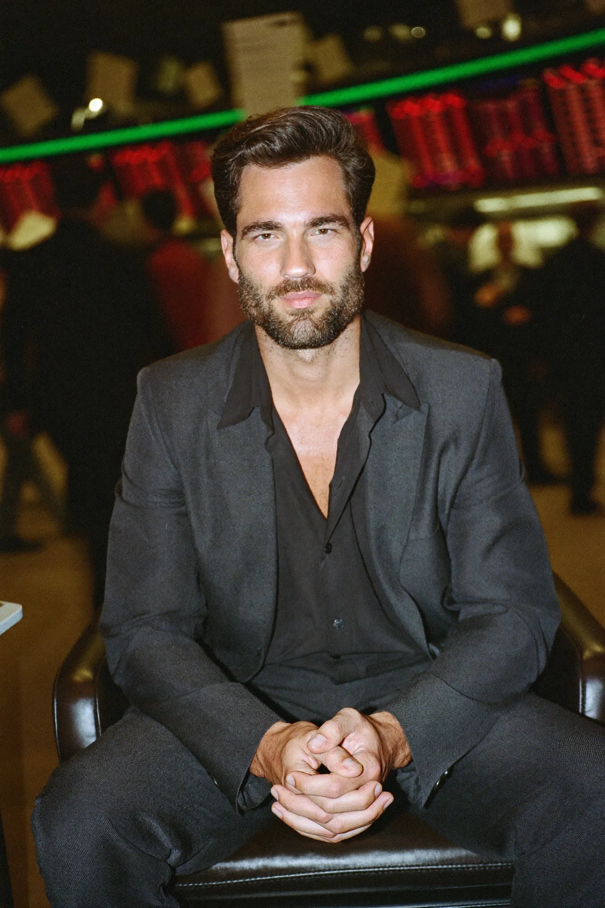
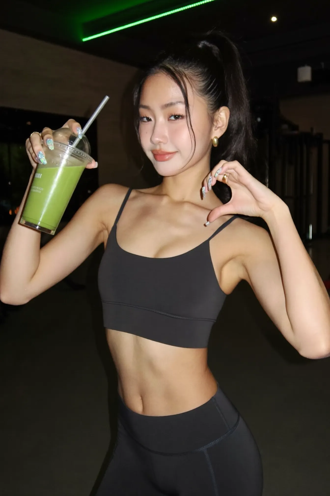
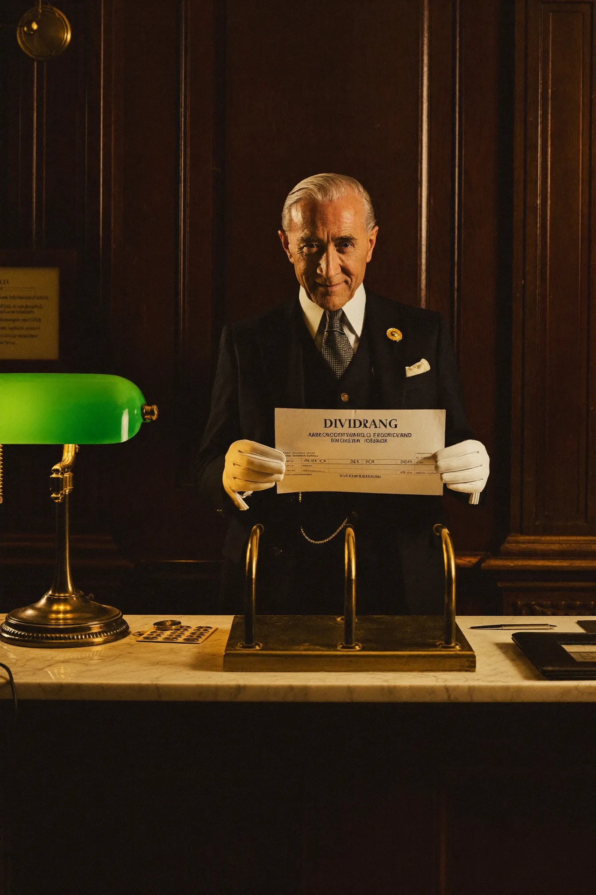
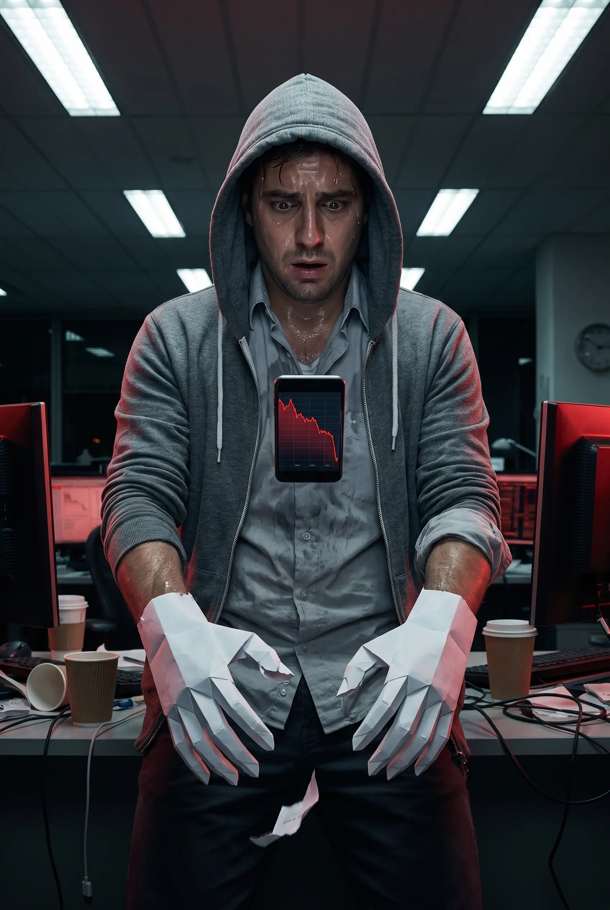
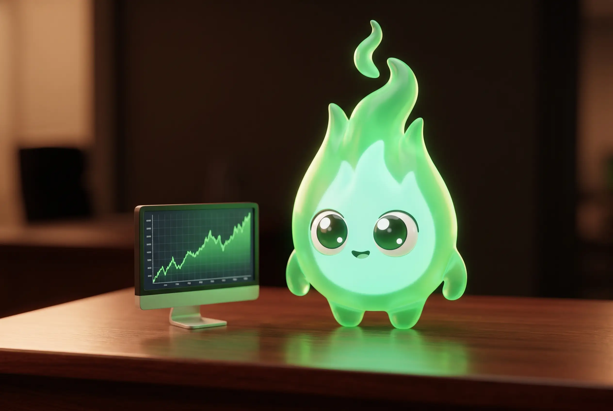
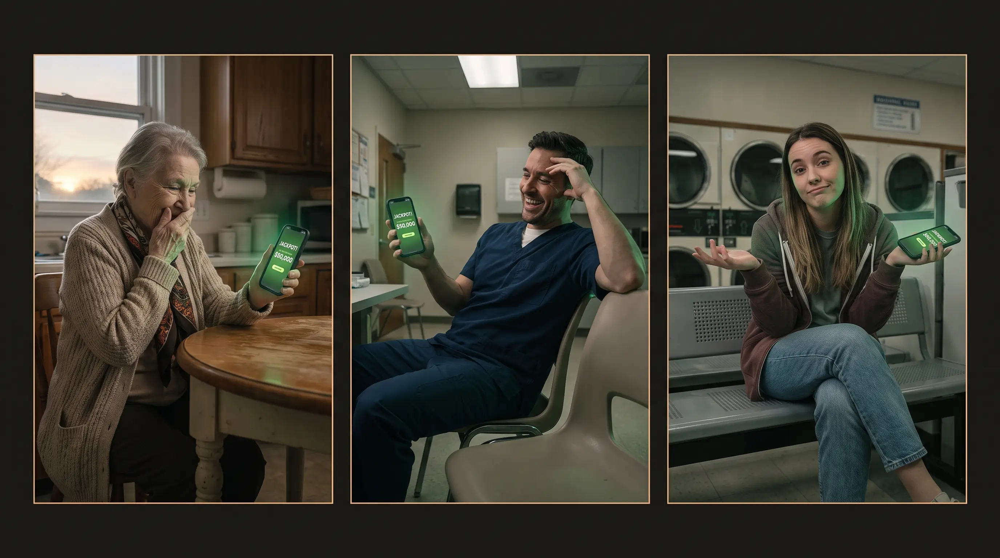

# $FIRE — Character Cast & Commercial Concepts

Concept round v1 — generated 2026-07-22 with Higgsfield (Soul 2.0 for photoreal, Nano Banana Pro for surreal/mascot/multi-panel). All concepts follow the v3 "Terminal Dark" direction: brokerage-statement premium, warm near-black, Robin green `#00C805`, red `#FF5000` reserved for losses, restraint as the signal. No wojak brutalism.

**STATUS (2026-07-23): Ember is the only ACTIVE character — full character sheet in [`ember/EMBER.md`](ember/EMBER.md). Everything below is the ARCHIVE: built-out cast kept on file for future commercials.** Winner previews live in `archive/` as `.webp`; full-res PNGs + all variants are linked per character (Higgsfield CDN). Job IDs can be re-displayed, upscaled, or used as Element/character references for video, so any archived character can be revived in one step.

---

## The cast (ARCHIVED — revivable on demand)

### 1. The Holder — brand hero

The flagship. A calm, impeccably dressed European man (user note 2026-07-23: Holder is European) who simply does not move while the market melts around him. Not smug — serene, like someone who already knows how it ends. Carries the hero spot and the credibility spot. Candidate for a locked reusable identity (save as Higgsfield Element, or train a Soul from 5+ generated angles) so he stays the same face across every commercial.

- Winner (v4 film-realism round, 2026-07-23 — v3 chad "didn't look real"): job `56bdc923-1b6c-403b-93cb-cd6a4ecd2a31` — [full PNG](https://d8j0ntlcm91z4.cloudfront.net/user_3F0bg3gqnKNYI7531IfsTzvahFf/hf_20260723_053101_56bdc923-1b6c-403b-93cb-cd6a4ecd2a31.png). 35mm film grain, natural skin texture, believable rugged chad, folded hands, trading floor bokeh.
- Alt (v4 variant B): job `f56b2ac7-8470-451e-9035-5498aebdf517` — [full PNG](https://d8j0ntlcm91z4.cloudfront.net/user_3F0bg3gqnKNYI7531IfsTzvahFf/hf_20260723_053101_f56b2ac7-8470-451e-9035-5498aebdf517.png)
- Earlier rounds (superseded): v3 airbrushed-chad jobs `ed0c4e89-04a9-4d17-a791-d7a885b6cb58`, `e44eadca-d3d9-4a63-bc4b-4d8018dde564` (too CGI-perfect); European v2 jobs `3e0e2feb-d704-46b0-9ba3-251c276f8454`, `d5d3a7c0-beb1-41f8-af91-843ddf460f1e` (not chad enough); v1 jobs `c951bbf6-bee3-4b3f-b714-8b197db7ad29`, `c05d8eb3-d507-4e8f-bb73-4f855de23c59` (non-European)
- Prompt key for realism: "unretouched editorial photograph, 35mm film grain, visible pores, believable imperfections" — keep this in all future Holder shots.
- Model: `soul_2`, 2:3

### 2. Diamond Hands — the icon (ABG)

She IS "diamond hands," literally — the meme made luxury. Direction (user note 2026-07-23): ABG aesthetic — early-20s Asian-American, balayage, winged liner, gold hoops, layered gold chains, black going-out fit — shot like a high-end jewelry ad with hands of faceted crystal catching the single green light. Still-image icon of the holding thesis: posters, OG images, hero stills.

- Winner (v4 — "Korean model Instagram fitness girl" 2026-07-23): job `b5a58d48-3f57-474b-9f29-4c385d5d8e01` — [full PNG](https://d8j0ntlcm91z4.cloudfront.net/user_3F0bg3gqnKNYI7531IfsTzvahFf/hf_20260723_053107_b5a58d48-3f57-474b-9f29-4c385d5d8e01.png). High ponytail, glowy K-beauty face, black athleisure set (logo-free), toned, matcha shake, half-heart pose, iridescent green nails, green LED gym, flash photo.
- v4 alts: job `f57919a9-0063-4b74-b87b-4a45a640b7d8` (brown set, to-go matcha, softer); job `02383c19-8279-4974-9a0c-ec108e9e399a` (strongest abs/lighting BUT visible Nike swooshes — do not ship without logo removal)
- Earlier rounds (superseded): casual boba-ABG jobs `fd908ebf-70e1-4e78-8357-59c6287bd5cc`, `7f78fbdf-6337-4539-b6fd-430629f28abc`, `7b4d82f9-84f4-4597-87f2-9e19d6ff3c8d`; glam-editorial jobs `4706a042-7045-4d13-a6c2-32a7418f16cd`, `09b9bf22-b4c7-479d-9449-e98f44c0a470`, `5e7a3cbb-2ffd-4739-8cbf-ede03db10f06`; ABG v1 jobs `a883c1c3-969a-4d99-a4e6-063e175dae84` (hands fully crystallized), `4bd0254b-c3bc-4376-b2b6-8b5fd9c31018`; non-ABG "Glass Hands" jobs `f0c618c9-29b1-4760-b503-fea213850dc6`, `06b82991-aaf3-49de-832f-81499236eb23`
- Note: the "diamond hands" surreal detail is carried by the crystal/glitter nails. For posters needing literal crystallized hands, re-prompt from the ABG v1 winner.
- Model: `soul_2`, 2:3

### 3. The Teller — old money for everyone

A distinguished private-bank teller (marble, brass, green banker's lamp, white gloves) who serves ordinary people like whales. Embodies "no minimum to earn" + the brokerage aesthetic in one person. Note: the statement paper's printed text is AI-garbled ("DIVIDRANG") — replace with a real prop/overlay in any final asset.

- Winner (variant B): job `8e0f6c09-36d2-4bbe-9e1f-3da233651d69` — [full PNG](https://d8j0ntlcm91z4.cloudfront.net/user_3F0bg3gqnKNYI7531IfsTzvahFf/hf_20260722_222716_8e0f6c09-36d2-4bbe-9e1f-3da233651d69.png)
- Alt (variant A): job `65bf59f1-9656-4440-a576-d1a8d1bac189` — [full PNG](https://d8j0ntlcm91z4.cloudfront.net/user_3F0bg3gqnKNYI7531IfsTzvahFf/hf_20260722_222717_65bf59f1-9656-4440-a576-d1a8d1bac189.png)
- Model: `soul_2`, 2:3

### 4. Paper Hands Pete — the villain who funds the heroes

Comedic foil. Sweaty, panicking, hands literally folded from white paper — one fingertip torn, a scrap fluttering down. Every time he sells, everyone else's phone pings with a dividend. Serializable: every dip is a new episode.

- Winner (redo A, both hands paper): job `169b72f5-5260-4f6f-a938-e46112da1843` — [full PNG](https://d8j0ntlcm91z4.cloudfront.net/user_3F0bg3gqnKNYI7531IfsTzvahFf/hf_20260722_223121_169b72f5-5260-4f6f-a938-e46112da1843.png). Quirk: the phone floats mid-air — regenerate or crop for final use.
- Alt (redo B, one paper hand mid-transformation + torn fingertip): job `b896757c-7590-46af-9480-78260a0aeeb9` — [full PNG](https://d8j0ntlcm91z4.cloudfront.net/user_3F0bg3gqnKNYI7531IfsTzvahFf/hf_20260722_223121_b896757c-7590-46af-9480-78260a0aeeb9.png)
- First attempts (paper-wrapped rather than paper-made, one has a stray caption): jobs `fad6ce18-053a-43cd-86c5-3ee06775e12e`, `286a430e-7e37-40f4-acf6-bf9864fdd238`
- Model: `nano_banana_pro`, 2:3

### 5. Ember — mascot (3D animation) — **ACTIVE, see [`ember/EMBER.md`](ember/EMBER.md)**

Direction (user notes 2026-07-23, four rounds): final style is polished 3D ANIMATION (Pixar/DreamWorks-quality render), not claymation (read as demented), not the logo silhouette (monstrosity), not a blob (slime). Final form: a glowing translucent green 3D flame with a mint inner core, emissive from within, elegant flickering tip, big glossy cartoon eyes, tiny smile, small rounded arms, standing beside a monitor with a rising green chart on a dark desk.

- Winner (3D round, variant A — glowing, standing by monitor): job `9911111c-2b45-46c9-998e-61a0e6fe026d` — [full PNG](https://d8j0ntlcm91z4.cloudfront.net/user_3F0bg3gqnKNYI7531IfsTzvahFf/hf_20260723_053056_9911111c-2b45-46c9-998e-61a0e6fe026d.png)
- Alt (3D round, variant B): job `b4f251b8-4608-4044-ba79-2b64a3cb90e5` — [full PNG](https://d8j0ntlcm91z4.cloudfront.net/user_3F0bg3gqnKNYI7531IfsTzvahFf/hf_20260723_053056_b4f251b8-4608-4044-ba79-2b64a3cb90e5.png)
- Earlier rounds (superseded): claymation flame (jobs `4e30a9de-1979-49bf-a92c-a559bd1e9cdb`, `852b2052-3d6d-4202-a831-c7629b987adf`), slime-y clay blobs (jobs `96fd4edc-5dd7-4761-a87e-b6eaac24b015`, `a3c687e4-ee50-454a-81bc-628c96288baf`), logo-silhouette clay puppet (jobs `a0c1506e-f020-4036-95af-ee677be08f9c`, `a7518215-16bf-484e-b293-aa4d06eb01e0`), flat-vector 6-pose sheet (`archive/the-ember-flat-sheet-reference.webp`, pose-ideas reference only)
- Model: `nano_banana_pro`, 3:2

### 6. The Friday Winners — rotating cast

Not one character but a cast of unexpected everypeople — retired teacher at dawn, night-shift nurse, laundromat student — each getting the green JACKPOT push. Keeps the Friday jackpot human, not casino. One winner takes the pot AND picks next week's stock.

- Winner (triptych A): job `2100861d-c656-4108-9f56-10a07bfc2439` — [full PNG](https://d8j0ntlcm91z4.cloudfront.net/user_3F0bg3gqnKNYI7531IfsTzvahFf/hf_20260722_222730_2100861d-c656-4108-9f56-10a07bfc2439.png)
- Alt (triptych B): job `ae2f80ac-f324-40e6-a262-7aa369129322` — [full PNG](https://d8j0ntlcm91z4.cloudfront.net/user_3F0bg3gqnKNYI7531IfsTzvahFf/hf_20260722_222730_ae2f80ac-f324-40e6-a262-7aa369129322.png)
- Model: `nano_banana_pro`, 16:9

---

## Commercial concepts

**A. "Still." (30s, hero)** — The Holder. Market apocalypse montage (red walls of quotes, blurred panic-sellers, papers flying) intercut with him calmly eating breakfast / riding the train. No dialogue, one piano note. End card in IBM Plex Mono: `DAY 90. MAX TIER.` → "We pay diamond hands." Build: 3–4 photoreal clips (`generate_video` image-to-video off the locked character) + VO-less sound design.

**B. "Thanks, Pete." (15–20s, social, serial)** — Pete rage-sells in a rainstorm of red. Smash cut: quiet apartments, coffee shops — ping, ping, ping — dividends landing. "Paper hands fund the dividend. Thanks, Pete." New episode every market dip.

**C. "The Appointment" (30s)** — The Teller. Full private-banking pastiche where every client is a normal person. Closer: "Private banking behavior. Zero minimum." (Attacks the unnamed competitor's 10,000-token floor without naming them, per the no-comparisons directive.)

**D. "92%" (45–60s, credibility)** — Documentary tone. Mono-type stat cards, timestamped like the site: `54 OF THE TOP 100 WALLETS HELD THROUGH A −92% DRAWDOWN`. Intercut with Friday-Winner faces. Precision instead of hype.

**E. "Friday" (20s)** — Heist-tension build: clock hands, pot odometer rolling, held breath — the draw lands on someone utterly ordinary, who shrugs and picks NVDA for next week. "Every Friday. One holder. Whole pot."

**F. The Ember explainers (60s, 3D animated series)** — Mechanics (streaks, tiers, exit fees, jackpot rollover) narrated over Pixar-style 3D footage of the glowing Ember: it naps on a vault while the dividend counter ticks up, flinches and dims at a red dip, brightens and flares as the streak grows, refuses the sell button. Build clip-by-clip via image-to-video from the 3D stills; the `video-explainer` workflow can supply narration structure. The Ember's glow level doubles as a story device (brightness = streak strength).

---

## Production notes

- Photoreal spots: lock The Holder (and Pete) as reusable identities first — save the winning still as a Higgsfield Element (instant, works with Nano Banana Pro / Seedance / Kling) or train a Soul (identity-faithful, Soul V2 / Soul Cinema only) — then generate video clips from stills for face consistency across shots.
- All numbers/tickers/statements shown in final assets must be composited real type (IBM Plex Mono), never AI-rendered text — every generation with visible type produced gibberish.
- Credits: this whole concept round (14 images, 2K) cost ≈65 credits; balance was ~4,580 on the Ultra plan before the run.
