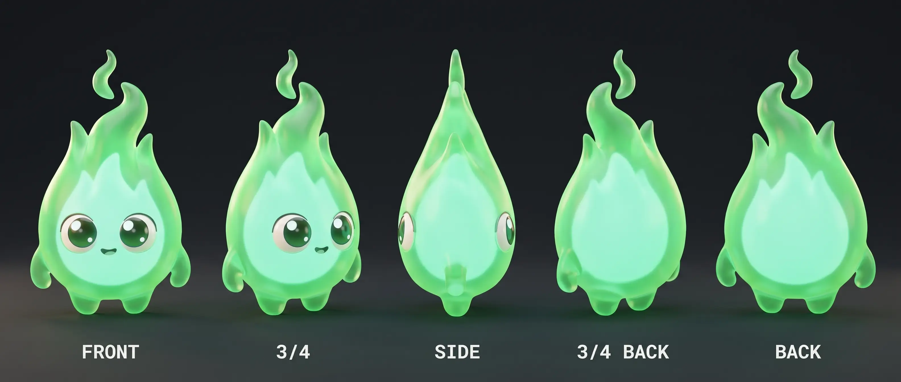
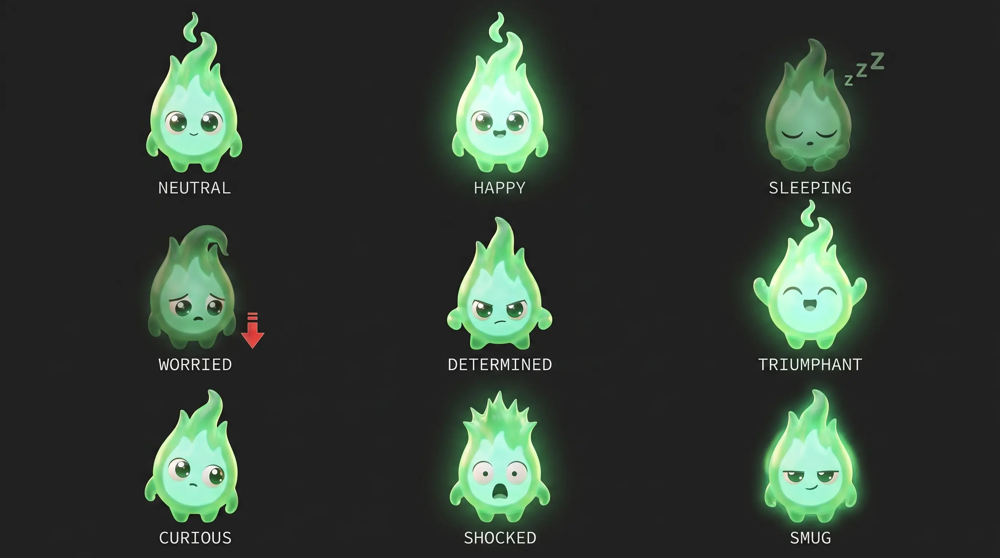

# EMBER — $FIRE Mascot Character Sheet

The official $FIRE mascot. A small, glowing green flame in polished 3D-animation style (Pixar/DreamWorks final-frame quality). Locked 2026-07-23 after four design rounds (flat vector → logo-puppet clay → cute clay → **3D**).

---

## 1. Identity

| | |
|---|---|
| **Name** | Ember |
| **Species** | A little fire. Not a mascot-of-FIRE — it IS FIRE: the token embodied, the flame that delivers shares to every holder, forever. |
| **Lore** | Ember is the visualization of the vision of making every American an owner (Vlad's thesis — kept UNNAMED on-screen per brand rules). While holders sleep, the little fire taps their phones and the dividend toast pings — it physically carries the value to you. Holding $FIRE = a hedged bet into stocks + a bet on Robinhood-chain performance; Ember IS that holding, alive. Terminology rule (user, 2026-07-23): never call Ember a faerie/fairy — it is just FIRE. Pronoun: it. |
| **Role** | Brand mascot, commercial lead, explainer-series guide, motion logo, sticker pack |
| **One-line essence** | FIRE itself, alive — it changes your life while you do nothing. |
| **Tagline** | "Own FIRE. Earn stocks without doing anything. Let Ember change your life." |
| **Canon hero render** | job `9911111c-2b45-46c9-998e-61a0e6fe026d` · [full PNG](https://d8j0ntlcm91z4.cloudfront.net/user_3F0bg3gqnKNYI7531IfsTzvahFf/hf_20260723_053056_9911111c-2b45-46c9-998e-61a0e6fe026d.png) |

## 2. Personality

- **Calm by default.** Ember is the mascot embodiment of holding: content, half-lidded, unbothered. Its resting state is a soft happy idle.
- **Never panics, briefly wobbles.** On a red dip its flame tip droops and the glow dims a notch — one beat of worry, then back to steady. It never runs, never sells.
- **Quietly smug on Fridays.** Jackpot day gets the half-lidded smirk and a glow pulse.
- **Physical comedy, no dialogue.** Ember doesn't talk; a narrator talks over it. All acting is body + glow + eyes.
- **Kind, not manic.** Cute ≠ hyper. Movements are small, cozy, deliberate. Think Calcifer's contentment, not a minion's chaos.

## 3. Visual specification

- **Body**: single teardrop flame, soft S-curve tip that flickers gently. Rounded bottom, no feet (hovers/rests directly on surfaces). Small rounded nub arms.
- **Material**: translucent emissive plasma — outer body vivid brand green, inner core lighter mint, glowing from within (subsurface scattering). Always casts soft green bounce light on nearby surfaces.
- **Face**: two big glossy dark cartoon eyes with strong catchlights; tiny simple mouth. Face sits low-center on the body. No nose, no brows (emotion is carried by eye shape + tip posture + glow).
- **Colors**: outer flame ≈ brand green `#00C805`; inner core mint ≈ `#7CFC9A`–`#B8FFD0` range; eyes near-black `#110E08` (brand bg color); environments warm near-black per Terminal Dark.
- **Proportions**: ~1:1.4 width:height at rest; eyes occupy ~1/3 of body height; arms tiny (never longer than one eye-width).
- **Style**: high-end 3D animation render. Soft three-point lighting, shallow DOF, cinematic. NOT claymation, NOT flat vector, NOT photoreal fire.

## 4. The glow system (signature story device)

Ember's brightness = streak strength. This is the brand mechanic made visible:

| State | Glow | Tip | Use |
|---|---|---|---|
| Day 1 (new holder) | small, soft | short | onboarding scenes |
| Holding / idle | steady warm | relaxed S-curve | default |
| Red dip | dims one notch | droops briefly | "sell big → streak resets" beats |
| Paper-handed nearby (Pete sells) | flickers, recovers | side-eye | Thanks-Pete spots |
| Day 90 / max tier | flared, bright, tall | proud upright | payoff shots |
| Friday jackpot | pulsing | candle-straight | jackpot countdowns |

Rule: glow changes are the punchline. Never add speed lines, sweat drops, or anime FX — the light does the acting.

## 5. Do / Don't

- **Do** keep it small in frame relative to environments (it's a little flame in a big money world).
- **Do** let it interact with Terminal-Dark UI props: tickers, odometer counters, green line charts, the claim button.
- **Don't** give it legs, fingers, eyebrows, or a big toothy mouth.
- **Don't** make it orange/red — Ember is green fire only (red is reserved for losses per brand rules).
- **Don't** let it speak on camera; it reacts, the narrator narrates.
- **Don't** render text via AI in final assets — composite real IBM Plex Mono.

## 6. Sheets & assets (this folder)

| File | What | Source job / full PNG |
|---|---|---|
| `hero.webp` | Canon hero render (desk + rising chart) | `9911111c-2b45-46c9-998e-61a0e6fe026d` · [PNG](https://d8j0ntlcm91z4.cloudfront.net/user_3F0bg3gqnKNYI7531IfsTzvahFf/hf_20260723_053056_9911111c-2b45-46c9-998e-61a0e6fe026d.png) |
| `turnaround.webp` | 5-view model turnaround (FRONT / 3-4 / SIDE / 3-4 BACK / BACK) | `4e9145d1-4e1b-4af0-9150-b4ca98910121` · [PNG](https://d8j0ntlcm91z4.cloudfront.net/user_3F0bg3gqnKNYI7531IfsTzvahFf/hf_20260723_061226_4e9145d1-4e1b-4af0-9150-b4ca98910121.png) |
| `expressions.webp` | 3×3 expression + glow-state grid (neutral, happy, sleeping, worried, determined, triumphant, curious, shocked, smug) | `0b75b675-4922-404b-94ae-4b5191730338` · [PNG](https://d8j0ntlcm91z4.cloudfront.net/user_3F0bg3gqnKNYI7531IfsTzvahFf/hf_20260723_061231_0b75b675-4922-404b-94ae-4b5191730338.png) |

Sheet alts (not saved locally): turnaround `fa129257-05a3-40e9-b393-56d52c7c60d2`, expressions `edc23c3c-f255-421f-9a9d-e416a846c734`.

## 7. Prompt bible (for consistent regeneration)

**Base identity string** (include verbatim, plus attach `hero` job/image as reference):

> "the exact same character as the attached reference — a cute glowing green 3D-animated flame mascot with a mint inner core, big glossy cartoon eyes, tiny smile, small rounded arms, translucent emissive material, high-end 3D animation render (Pixar/DreamWorks final-frame quality), NOT claymation"

**Scene formula**: base identity + one action + one Terminal-Dark prop + lighting note ("soft cinematic three-point lighting, warm near-black background, green bounce light").

**Video**: image-to-video from a still in this folder; motion should be gentle idle flicker + one small action; the glow may breathe. Recommend Higgsfield `models_explore(action:'recommend')` per clip; keep clips ≤10s.

**Consistency**: for multi-shot work, register the hero render as a reference Element (`show_reference_elements`, action=create) and reuse it in every generation.

## 8. Starter scene backlog (explainer series)

1. Ember naps on a tiny vault; dividend odometer ticks up beside it. (hold = earn)
2. Red dip flashes on the monitor; Ember dims, droops… steadies… re-brightens. (don't sell)
3. A giant shiny SELL button descends; Ember looks at it, looks at camera, pushes it off the desk. (diamond hands)
4. Calendar flips to FRIDAY; Ember goes candle-straight, glow pulsing, watching the jackpot counter. (jackpot)
5. Day-90 badge appears; Ember flares to full brightness and does the tiny arms-up. (max tier)
6. Split screen: Pete's paper hands hit sell; Ember's glow flickers from the shockwave, then a dividend ping lands and it smirks. (exit fees fund holders)
